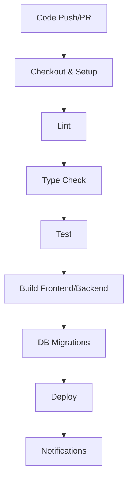

# Analystics-Platform.AI

**Author:** Sourabh Kumar

## Table of Contents
- [Overview](#overview)
- [Directory Structure](#directory-structure)
- [Features](#features)
- [User Preferences](#user-preferences)
- [System Architecture](#system-architecture)
  - [Frontend](#frontend-architecture)
  - [Backend](#backend-architecture)
  - [Data Storage](#data-storage-solutions)
- [Core Services & Workflows](#core-services--workflows)
  - [Web Scraping Engine](#web-scraping-engine)
  - [NLP & Knowledge Extraction](#natural-language-processing-nlpservice)
  - [Knowledge Graph Builder](#knowledge-graph-builder)
  - [AI Q&A Engine](#ai-qa-engine)
  - [Real-time Monitoring](#real-time-progress-monitoring)
- [Data Flow Overview](#data-flow)
- [External Dependencies](#external-dependencies)
- [Deployment & Scalability](#deployment-strategy)
  - [Development](#development-environment)
  - [Production](#production-build)
  - [Scalability & Reliability](#scalability--reliability)
- [Security & Compliance](#security--compliance)
- [Workflow Architecture](#workflow-architecture)
- [Future Enhancements](#future-enhancements)
- [Quick Start](#quick-start)

---

## Overview

A full-stack platform for intelligent web scraping, NLP-powered knowledge graph generation, and AI-driven natural language Q&A. The system ingests web content, extracts entities and relationships, builds interactive graphs, and answers user questions based on the discovered knowledge.

---

## Directory Structure

```
data-analytics-graph/
│
├── backend/
│   ├── main.py                # FastAPI entry point
│   ├── routers/
│   │   ├── scrape.py          # Scraping endpoints
│   │   ├── graph.py           # Graph building/query endpoints
│   │   └── qa.py              # QA endpoints
│   ├── services/
│   │   ├── scraper.py         # Scrape URLs
│   │   ├── nlp.py             # Entity/relationship extraction
│   │   ├── graph_builder.py   # Build Neo4j graph
│   │   └── qa_engine.py       # LangChain/OpenAI graph QA
│   └── config.py              # API keys, Neo4j configs
│
├── frontend/
│   ├── streamlit_app.py       # Streamlit graph explorer
│   └── react_app/             # React app (optional)
│
├── notebooks/
│   └── colab_version.ipynb    # Full pipeline in one notebook
│
├── requirements.txt
├── README.md
└── .env                       # API keys
```

---

## Features

- **Web scraping** with configurable depth, concurrency, and robustness.
- **Entity extraction** and **relationship mapping** using NLP.
- **Interactive knowledge graph** construction with graph metrics and visualization.
- **Natural language Q&A** over graph data, powered by GPT-4/OpenAI.
- **Real-time progress monitoring** via WebSocket.
- **Frontend** in React & Streamlit for visualization and user interaction.
- **Notebook support** for end-to-end reproducible data analysis.
- **Scalable backend** with modular services, database abstraction, and future extensibility.

---

## User Preferences

- **Communication Style**: Simple, everyday language

---

## System Architecture

### Frontend Architecture

- **Framework**: React 18 + TypeScript, Vite for fast builds/HMR.
- **UI Components**: Shadcn/ui + Radix UI (accessibility, composability), custom themes.
- **Styling**: Tailwind CSS with custom variables.
- **State Management**: TanStack Query (React Query).
- **Routing**: Wouter.
- **Forms & Validation**: React Hook Form + Zod.
- **Visualization**: Chart.js for metrics/graph summaries.
- **Real-time**: WebSocket client for live updates.
- **Accessibility**: Radix UI primitives.

#### Frontend Directory Example

```
src/
  components/
  pages/
  hooks/
  api/
  types/
  utils/
  styles/
  websocket/
```

### Backend Architecture

- **Runtime**: Node.js (TypeScript, ES modules) or Python (FastAPI).
- **Framework**: Express.js or FastAPI.
- **Build System**: ESBuild (Node), or straight Python.
- **Real-time**: WebSocket server.
- **Service Layer**:
  - Scraper, NLP, GraphBuilder, QA Engine.
- **Database Layer**: PostgreSQL (Neon) + Drizzle ORM or Neo4j.
- **Storage Abstraction**: `IStorage` interface.
- **Concurrency**: Worker threads (Node), async jobs (Python).

#### Backend Directory Example

```
src/
  server.ts or main.py
  services/
  db/
  websocket/
  utils/
  config/
  types/
```

---

### Data Storage Solutions

- **Primary Database**: PostgreSQL (Neon) or Neo4j.
- **ORM**: Drizzle ORM (Node) or direct Cypher (Python).
- **Schema Management**: Drizzle Kit (Node).
- **Abstraction**: `IStorage` interface.
- **Connection Pooling**: Drizzle/Postgres or Neo4j driver.
- **File Storage**: Local by default, upgradable to cloud.

---

## Core Services & Workflows

### Web Scraping Engine

- **Configurable depth, concurrency, delays**
- **Worker threads**/async jobs for parallel scraping.
- **HTML parsing** with Cheerio or BeautifulSoup.
- **Error tracking, retries**
- **Progress events** via WebSocket.

### Natural Language Processing

- **Entity Extraction**: PERSON, ORG, GPE, NORP, DATE, TOPIC.
- **Relationship Mapping**: Connections between entities.
- **Pipeline**: Raw text → Entities → Relationships → Graph nodes/edges.

### Knowledge Graph Builder

- **Interactive, color-coded graph**
- **Node types**: Person, Organization, Location, Date, Topic.
- **Edge types**: Employment, location, affiliation, etc.
- **Graph metrics**: Density, connectivity, components, centrality.

### AI Q&A Engine

- **OpenAI GPT-4 integration**
- **Contextual answers** using content + graph.
- **Source citations** and follow-up questions.

### Real-time Progress Monitoring

- **WebSocket broadcasts** for scraping progress, entity extraction, errors.
- **Metrics**: URLs processed, success/failure, entities/relationships found.

---

## Data Flow

1. **User Initiates Scraping**: UI or notebook.
2. **Backend Scraping**: Service processes URLs.
3. **Content Extraction**: HTML parsed/cleaned.
4. **NLP Processing**: Entity/relationship extraction.
5. **Graph Construction**: Build Neo4j/PG knowledge graph.
6. **Database Storage**: Store entities, relationships, and raw content.
7. **Real-time Updates**: WebSocket status.
8. **User Queries**: Q&A over knowledge graph.

---

## External Dependencies

### Database & ORM

- **PostgreSQL**: Neon (serverless), UUID PKs, pooling.
- **Neo4j**: Graph database for relationships.
- **Drizzle ORM**: Type-safe queries/migrations (Node).
- **Drizzle Kit**: Schema management.

### AI & NLP

- **OpenAI API**: GPT-4.
- **spaCy**: Entity extraction (Python, planned).
- **Cheerio/BeautifulSoup**: HTML parsing.

### Frontend Libraries

- **React 18 + Vite**
- **Shadcn/ui, Radix UI**
- **Tailwind CSS**
- **Chart.js**
- **React Hook Form + Zod**

### Dev Tools

- **TypeScript**
- **ESLint/Prettier**
- **TSX/ESBuild** (Node)

---

## Deployment Strategy

### Development Environment

- **Frontend**: Vite dev server.
- **Backend**: TSX/Node or Python FastAPI.
- **Env Variables**: `.env` for secrets.
- **Type Checking**: TypeScript.
- **Testing**: Jest/Cypress (Node), Pytest (Python).

### Production Build

- **Frontend**: Vite → `dist/public`
- **Backend**: ESBuild (Node) → `dist/index.js`
- **Database**: Drizzle migrations.
- **Static Assets**: Express static middleware.
- **Env Variables**: `.env.production`

### Environment Requirements

- **Node.js**: ES module support.
- **Python**: FastAPI, Neo4j, etc.
- **PostgreSQL/Neo4j**: DB connection.
- **OpenAI**: API key.
- **Port**: Configurable.

---

## Scalability & Reliability

- **WebSocket Scaling**: Redis pub/sub for multi-instance (future).
- **Database**: Connection pooling.
- **File Storage**: Cloud ready.
- **Rate Limiting**: To be added.
- **Error Handling**: Centralized logging.
- **Monitoring**: Prometheus/Grafana (future).

---

## Security & Compliance

- **Secrets**: Managed via `.env`.
- **API Auth**: JWT/bearer (recommended).
- **User Data**: GDPR/CCPA compliance.
- **Sanitization**: Input/output.

---

## Workflow Architecture

### CI/CD Workflow

This project uses GitHub Actions for continuous integration and deployment. The workflow ensures code quality, build reliability, and smooth deployment.

#### Workflow Steps

1. **Checkout & Setup**
    - Checks out the repository code
    - Sets up Node.js/Python, installs dependencies

2. **Lint**
    - Runs ESLint/Prettier (Node) or Flake8/Black (Python)

3. **Type Checking**
    - Runs `tsc --noEmit` (Node) or `mypy` (Python)

4. **Testing**
    - Executes Jest/Pytest

5. **Build**
    - Builds frontend (`vite build`)
    - Bundles backend (`esbuild` or Python package)

6. **Database Migrations**
    - Runs Drizzle or Alembic migrations

7. **Deployment**
    - Deploys to hosting provider (Vercel, Railway, Render, or VPS)

8. **Notifications**
    - Sends status updates to Slack/Discord (optional)

#### Example Workflow YAML

```yaml
name: CI/CD Pipeline

on:
  push:
    branches: [main, dev]
  pull_request:
    branches: [main, dev]
  workflow_dispatch:

jobs:
  build-test-deploy:
    runs-on: ubuntu-latest
    steps:
      - name: Checkout code
        uses: actions/checkout@v4

      - name: Setup Node.js
        uses: actions/setup-node@v4
        with:
          node-version: '20'

      - name: Install dependencies
        run: pnpm install

      - name: Lint
        run: pnpm lint

      - name: Type Check
        run: pnpm typecheck

      - name: Test
        run: pnpm test

      - name: Build Frontend
        run: pnpm build:frontend

      - name: Build Backend
        run: pnpm build:backend

      - name: Run DB Migrations
        run: pnpm migrate

      - name: Deploy
        run: echo "Deploy step here (e.g., Vercel, Railway, etc.)"
```

#### Workflow Diagram



---

## Future Enhancements

- **NLP**: spaCy or similar for richer extraction.
- **Scaling**: Redis for WebSocket/job queues.
- **Cloud Storage**: S3/GCS support.
- **Authentication**: OAuth/API keys.
- **Rate Limiting**: API & scraping.
- **Monitoring**: Metrics & dashboards.
- **UI**: Graph editing, export/import, advanced filtering.

---

## Quick Start

1. **Clone repo & install dependencies**
2. **Configure `.env` with DB and OpenAI keys**
3. **Run migrations:** `drizzle-kit up`
4. **Start dev servers:**
   - Frontend: `pnpm dev` (Vite)
   - Backend: `pnpm start` (TSX)
5. **Open UI, configure scraping, monitor progress**
6. **Query the knowledge graph via natural language Q&A**

---

For more details, see individual docs in the `/docs` directory.
